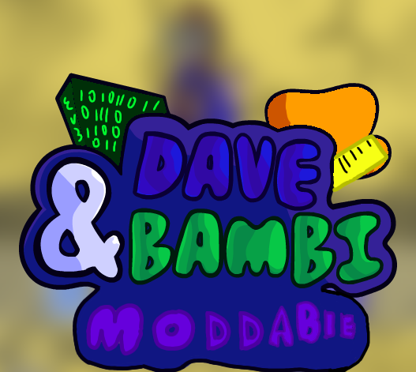

Extra Keys from: https://github.com/Magman03k7/VsDave-ExtraKeysAddon

Need help on polymod coding

## Dependencies you need to build
flixel-addons is 2.11.0 btw

# VS DAVE (DAVE ENGINE)
this is dave

say hi to dave
please say hi to him

## About the OG mod
Powered by a heavily modified version of Kade Engine, The mod includes lots of additional improvements such as
- OpenGL Shaders
- Character Selector
- Languages
- [Strawberry Input](https://github.com/benjaminpants/Funkin-Strawberry)

If you're looking to compile the mod/make your own modification, [look here](Modding.md).
